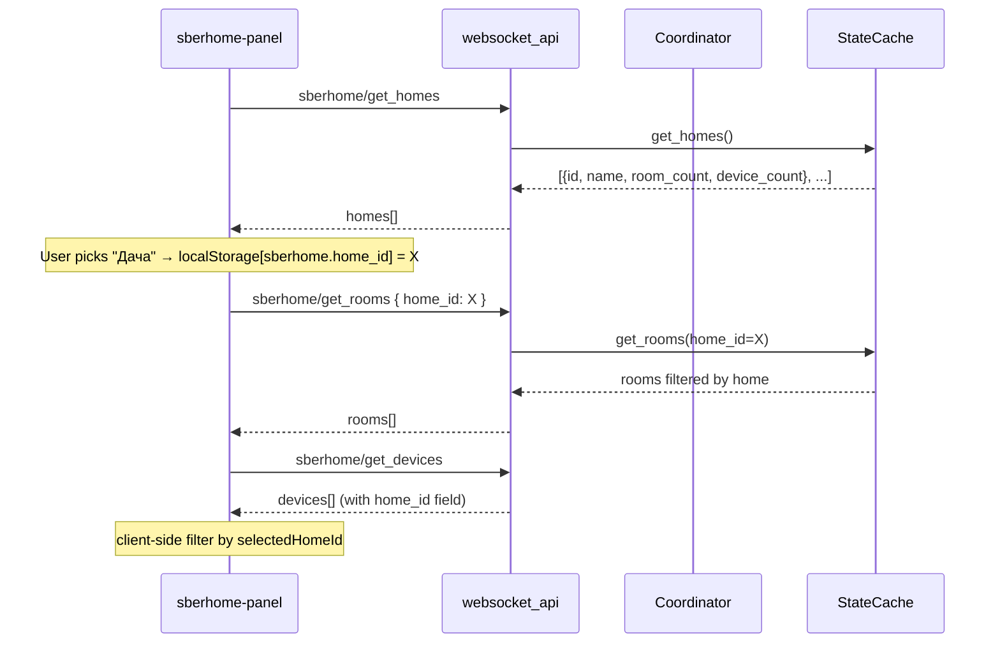

# Issue #2 — Multi-home UI-фильтр

**Цель:** дать юзерам с несколькими домами в Сбере (например «Мой дом» + «Дача»)
возможность переключаться между ними в SberHome-панели. Backend по-прежнему
тянет устройства из всех домов, фильтр работает только в UI (lossless: HA
entities, история, automations не трогаются).

**Issue:** [#2 «Добавить возможность выбора дома»](https://github.com/dzerik/ha-sberhome/issues/2)
**Версия:** 4.6.0 (MINOR — новая фича, BC-совместимая)
**Подход:** B (UI-only filter), dropdown в header панели

---

## Контекст

### Что есть сейчас

- `GET /device_groups/tree` отдаёт **полное дерево** пользователя: HOME → ROOM → devices.
  Если у юзера 2 дома — оба придут в одном tree.
- `StateCache._walk_tree` рекурсивно собирает **все** устройства из **всех**
  HOME-узлов в одну плоскую коллекцию.
- `StateCache.get_home()` возвращает **первый** найденный HOME — single-home
  assumption (см. `state_cache.py:63-70`).
- WS endpoint `sberhome/get_rooms` (`rooms.py:13`) возвращает rooms только
  одного дома + `home: {id, name}` для UI.
- Panel `sberhome-rooms-view.js:15-24` принимает single `home` объект.

### Что меняется

- StateCache начинает tracking device → home_id mapping.
- Новый WS endpoint `sberhome/get_homes` → список всех домов с метаданными.
- Существующий `sberhome/get_rooms` расширяется опциональным фильтром
  `home_id` (default = все).
- Panel: dropdown «дом» в header, состояние в localStorage, все views
  получают `selectedHomeId` и фильтруют локально.

### Что НЕ меняется

- `config_flow` — без новых шагов.
- HA entity creation — все устройства из всех домов остаются.
- Sber API client (`aiosber/`) — без изменений (он уже multi-home aware
  через UnionType.HOME).
- Scenarios/intents — пока используют `state_cache.get_home()` (первый).
  Multi-home intents — отдельный enhancement, не в этом PR.

---

## Архитектура



### Слои

```mermaid
flowchart TB
    A[Sber API /device_groups/tree] --> B[StateCache._walk_tree]
    B --> C[(devices)]
    B --> D[(groups)]
    B --> E[(device_to_home_id) NEW]
    B --> F[(device_to_room_id)]

    C --> G[WS get_devices<br/>+ home_id field NEW]
    D --> H[WS get_homes NEW]
    D --> I[WS get_rooms<br/>+ home_id filter NEW]

    G --> J[Panel views]
    H --> J
    I --> J
    J --> K[selectedHomeId localStorage]
    K --> J
```

---

## Декомпозиция по слоям

### 1. `aiosber/service/state_cache.py` — track home для каждого device

**Изменения:**
- Новый instance var: `_device_to_home_id: dict[str, str]`, `_device_to_home_name: dict[str, str]`.
- `_walk_tree` принимает `current_home_id`/`current_home_name` — при входе в HOME-узел обновляет их, дальше прокидывает рекурсивно.
- Новые методы:
  - `get_homes() -> list[UnionDto]` — все HOME-узлы.
  - `device_home_id(device_id) -> str | None`.
  - `device_home_name(device_id) -> str | None`.
- `get_rooms(home_id: str | None = None)` — опциональный фильтр.
- `get_home()` оставляем для BC (возвращает первый HOME, пока для intents).

**Файлы:** `custom_components/sberhome/aiosber/service/state_cache.py`

**Acceptance:**
- `tests/aiosber/service/test_state_cache.py` — тест с 2 HOME-узлами:
  каждое device получает correct home_id, `get_homes()` возвращает оба,
  `get_rooms(home_id=X)` фильтрует.

### 2. `websocket_api/rooms.py` — расширение + новый endpoint

**Изменения:**
- Новая команда `sberhome/get_homes`:
  ```python
  {
    "homes": [
      {"id": "h1", "name": "Мой дом", "room_count": 4, "device_count": 12, "is_default": true},
      {"id": "h2", "name": "Дача", "room_count": 2, "device_count": 5, "is_default": false},
    ]
  }
  ```
  `is_default` — это первый HOME из tree (тот, который сейчас отдаёт `get_home()`).
- Существующая `sberhome/get_rooms` принимает опциональный `home_id` параметр:
  - Если задан — rooms/total_devices фильтруются по этому дому.
  - Если не задан — старое поведение (все rooms, total = все устройства). BC.
- Регистрация в `websocket_api/__init__.py`.

**Файлы:**
- `custom_components/sberhome/websocket_api/rooms.py`
- `custom_components/sberhome/websocket_api/__init__.py`

**Acceptance:**
- `tests/test_websocket_*.py` — новый файл `test_websocket_homes.py` для
  get_homes; existing rooms tests расширяются `home_id` фильтром.

### 3. `websocket_api/devices.py` — home_id в payload

**Изменения:**
- В существующих device-payload'ах добавить `home_id` и `home_name`
  поля (через `cache.device_home_id(device_id)`).

**Файлы:** `custom_components/sberhome/websocket_api/devices.py`

**Acceptance:**
- `tests/test_websocket_devices.py` или соответствующий — devices
  включают home_id.

### 4. `www/sberhome-panel.js` — header dropdown + state plumbing

**Изменения:**
- Загрузка `homes` параллельно с `devices`/`status` в `connectedCallback`
  (мерж в существующий `Promise.all`).
- Новый property `_selectedHomeId: string | null` — `null` означает «All».
- Init: читать из `localStorage.getItem("sberhome.selected_home_id")`.
  Default — `null` (All). Если в localStorage невалидный (дом не в списке) — сброс на null.
- Persist при изменении: `localStorage.setItem(...)`.
- Render: в header (рядом с заголовком панели) `<select>` или
  `<sberhome-home-switcher>` компонент:
  ```
  [🏡 Все дома ▾]   ← variants: All / Мой дом / Дача
  ```
- Прокидывать `.selectedHomeId=${this._selectedHomeId}` во все children-views.

**Файлы:**
- `custom_components/sberhome/www/sberhome-panel.js`
- (новый) `custom_components/sberhome/www/components/sberhome-home-switcher.js`

### 5. Views — accept `selectedHomeId` и фильтруют

**Изменения по views:**

| View | Поведение |
|---|---|
| `sberhome-rooms-view.js` | Принимает `selectedHomeId`, передаёт в WS `get_rooms { home_id }`. `home` → берётся из `homes[]` по id. Если selectedHomeId=null → показывает все rooms из всех домов, групп. с заголовком home_name. |
| `sberhome-device-picker.js` | Фильтрует `devices` где `d.home_id === selectedHomeId` (если != null). |
| `sberhome-debug-view.js` | То же, фильтр device list. |
| `sberhome-intents-view.js` | Опционально: фильтрует intents с device_ids только из selectedHome. Подумать позже — не блокер. |
| `sberhome-monitor-view.js` | То же, фильтр device-events. |
| `sberhome-status-card.js` | Опционально: показать "x devices in N homes". |

**Файлы:** `custom_components/sberhome/www/components/*.js` (~5 файлов
изменений, ~20-40 строк каждый).

### 6. Тесты

- `tests/aiosber/service/test_state_cache.py`:
  - `test_walk_tree_multi_home` — 2 HOME-узла, каждый со своими ROOM/devices.
  - `test_get_homes_returns_all` — возвращает оба HOME.
  - `test_device_home_id_mapping` — корректный для каждого device.
  - `test_get_rooms_with_home_filter` — фильтр по home_id.
- `tests/test_websocket_homes.py`:
  - `test_get_homes_returns_metadata` — id, name, room_count, device_count.
  - `test_get_homes_empty_cache` — `[]` если кеш пуст.
  - `test_get_rooms_with_home_filter` — расширение существующего теста.
- (Опционально) Snapshot test panel.html — проверка, что header содержит switcher.

### 7. Translations

В `strings.json` + `translations/{en,ru,be,kk,uz}.json` добавить
строки для switcher:

```json
"panel": {
  "home_switcher": {
    "all_homes": "Все дома" / "All homes" / ...,
    "select_home": "Выберите дом" / "Select home" / ...
  }
}
```

Эти строки доступны панели через `hass.localize("component.sberhome.panel.home_switcher.all_homes")`.

### 8. Документация

- `README.md` — секция «Multi-home support», скриншот dropdown.
- `CHANGELOG.md` — v4.6.0 запись.

---

## Acceptance criteria

1. **Один дом (legacy):** существующие single-home юзеры не видят разницы.
   Switcher либо не показывается (1 дом → скрыт), либо показывается
   inactive (`disabled`).
2. **Несколько домов:** в header панели появляется dropdown «🏡 Все дома ▾»
   со списком всех HOME из Sber.
3. **Выбор дома:** при выборе конкретного дома все views фильтруют
   списки rooms/devices. Состояние сохраняется в localStorage.
4. **HA entities не трогаются:** Settings → Devices → SberHome продолжает
   показывать ВСЕ устройства из всех домов. История, automations работают.
5. **WS API BC:** `sberhome/get_rooms` без `home_id` параметра работает
   как раньше. Новые клиенты могут передавать `home_id`.
6. **Тесты:** все existing проходят + 8-10 новых для multi-home.

---

## Версия и git-flow

- **Версия:** 4.5.0 → 4.6.0 (MINOR — новая фича, BC).
- **Файлы для bump:** `pyproject.toml`, `custom_components/sberhome/manifest.json`.
- **Коммиты** (по слоям, для удобства review):

  1. `feat(state_cache): track device→home_id mapping + get_homes()`
  2. `feat(ws): sberhome/get_homes endpoint + home_id filter в get_rooms`
  3. `feat(ws): include home_id в device payload`
  4. `feat(panel): home switcher dropdown в header + state plumbing`
  5. `feat(panel): filter rooms/devices/debug views по selectedHomeId`
  6. `docs: multi-home support в README + CHANGELOG (v4.6.0)`

  Можно склеить в 2-3 commit'а если так удобнее.

- **Release:** tag `v4.6.0`, GH release с release notes.
- **Issue:** **НЕ закрываем**, оставляем комментарий с инструкцией
  обновления и просьбой подтвердить. Закрываем после ответа @alting.

---

## Out-of-scope (на будущее)

- **Backend жёсткий фильтр** (hybrid B→A) — config option
  `hidden_home_ids: list[str]` для пользователей, которые хотят
  полностью скрыть второй дом из HA. Делается отдельным PR если поступит request.
- **Multi-home для intents/scenarios** — сейчас `state_cache.get_home()`
  возвращает первый HOME, и intents работают только для него.
  Расширение `IntentService` на multi-home — отдельный PR.
- **HA Areas mirror** — создавать Area за каждый HOME (auto, через
  device_registry). Усложнение, не критично для UX.

---

## Риски

| Риск | Оценка | Митигация |
|---|---|---|
| Сбер меняет JSON формат HOME-узлов | низкий | UnionDto уже типизирован, DTO-парсинг устойчив |
| Юзер с 1 домом — лишний UI элемент | низкий | если homes.length <= 1 → switcher не показывается |
| localStorage state stale (дом удалён) | низкий | при load валидируем home_id ∈ homes, fallback на null |
| Многоязычные строки в панели не подгружаются | средний | использовать hass.localize или fallback на русский |
| Регрессия `get_rooms` без home_id | низкий | unit-тест на BC + параметр default=None |
