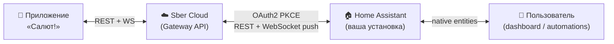

# SberHome for Home Assistant

[](https://hacs.xyz)
[](https://github.com/dzerik/ha-sberhome/releases)
[](LICENSE)
[](tests/)
[](https://github.com/dzerik/ha-sberhome/actions/workflows/validate.yml)
[](https://www.home-assistant.io)

[](https://my.home-assistant.io/redirect/hacs_repository/?owner=dzerik&repository=ha-sberhome&category=integration)

Нативная интеграция **Sber Smart Home** (приложение «Салют!») в Home Assistant.
Привозит устройства из экосистемы Сбер (свет, розетки, датчики, климат, шторы,
пылесосы, ТВ, домофоны, чайники) в HA через официальный Sber Gateway API
(`gateway.iot.sberdevices.ru`) с OAuth2/PKCE авторизацией через `id.sber.ru`
и WebSocket push для мгновенных обновлений.

## Благодарности

Отдельная благодарность проекту
[**altfoxie/ha-sberdevices**](https://github.com/altfoxie/ha-sberdevices) —
его находки по авторизации стали отправной
точкой для ha-sberhome. Мы вдохновились и переработали всё под своё
видение, но стоим у него на плечах.


> [!NOTE]
> Если вам, наоборот, нужно **выставить HA-устройства в Салют** (голосовое
> управление «Салют, включи свет»), посмотрите sister-проект
> **[sber-mqtt-bridge](https://github.com/dzerik/sber-mqtt-bridge)** —
> выставление HA → Сбер через MQTT-партнёрский API.

## Как это работает



1. OAuth2 PKCE через `id.sber.ru` → получение «companion» токена, которым
   ходит мобильное приложение «Салют!».
2. Polling `GET /device_groups/tree` для discovery устройств и комнат.
3. WebSocket push `wss://ws.iot.sberdevices.ru` для real-time
   `DEVICE_STATE` (включение/выключение, изменение атрибутов
   датчиков) — polling снижается до 10 минут, пока WS жив.
4. HA ↔ Sber команды через `PUT /devices/{id}/state`.

## Возможности

- **29 категорий устройств** — полное покрытие Sber Gateway API
  (свет, розетки, реле, датчики темп/влажности/протечки/двери/движения/
  дыма/газа, шторы, ворота, клапаны, все HVAC, увлажнители, очистители,
  чайники, пылесосы, ТВ, сценарные кнопки, домофоны, хабы, **колонки
  SberBoom/Portal/Box/Satellite**).
- **Sber Cloud Scenarios → HA buttons** — каждый твой Sber-сценарий
  (`/scenario/v2/scenario`) появляется как `button` entity. Нажми в
  HA → выполняется в облаке Сбера. Идеально для интеграции в HA-
  автоматизации триггеров от датчиков HA, которых нет в Sber.
- **At-home presence** — `binary_sensor.sber_at_home` зеркалит
  глобальную переменную `at_home` из Sber-облака; парный
  `switch.sber_at_home` пишет обратно. Используй как `condition` или
  `trigger` в HA-автоматизациях («когда пришёл домой»).
- **Sber LED indicator** — `light.sber_indicator_color` (HSV) управляет
  цветом и яркостью LED-кольца на колонках Сбера через `IndicatorAPI`.
- **Per-device firmware updates** — `update.<device>_firmware` per
  устройству показывает доступную версию прошивки из
  `/inventory/ota-upgrades` рядом с installed (sw_version). Когда
  Sber публикует обновление — золотой колокольчик в шапке HA.
  Установка управляется Sber-облаком (HA-side install не реализован).
- **Hub diagnostics** — для SberBoom Home / SberPortal / intercom
  координатор раз в час дёргает `/devices/{id}/discovery` и
  экспонирует `sensor.<hub>_subdevice_count` — сколько связанных
  через хаб устройств.
- **Opt-in picker** — устройства не создаются в HA автоматически; вы
  выбираете нужные во встроенной панели. Неподдерживаемые категории
  визуально приглушаются с бейджем «не поддерживается» и не
  включаются (server-side guard).
- **Real-time WebSocket push** — изменение состояния датчика в Сбер
  → мгновенно в HA (обычно <2 сек).
- **Adaptive polling** — когда WS активен, REST-опрос раз в 10 минут
  (только для discovery новых устройств и ренеймов); при обрыве WS
  возвращается к пользовательскому интервалу (default 30 сек).
- **Multi-cadence background polling** — сценарии каждые 5 минут,
  OTA / discovery / indicator каждый час (отдельно от device tree,
  чтобы не нагружать API). Best-effort: ошибка в одном potoke не
  валит остальные.
- **Опционные Zigbee-датчики** — реле/лампочки подтягивают
  Zigbee-сенсоры производителя (батарея, сигнал, tamper, alarm_mute).
- **Intercom-кнопки** `button.intercom_unlock` /
  `button.intercom_reject_call` — управление домофоном из HA.
- **Pairing WS surface** — 8 WS-команд поверх `PairingAPI` (Wi-Fi /
  Zigbee / Matter handshake) для будущего custom-panel «Add device»
  wizard. Полноценный config_flow UI пока не реализован, surface готов.
- **Встроенная панель DevTools** (вкладка Monitor в сайдбаре):
  - **State Diffs** — дельта `reported_state` вместо
    полного payload'а, чтобы увидеть что именно поменялось.
  - **Command Confirmation Tracker** — ловит silent rejection от Sber
    (HTTP 200 без применения команды) по отсутствию ключей в
    следующем `reported_state`.
  - **Schema Validation** — детектит API drift на лету.
  - **Replay / Inject** — подсунуть синтетический WS-пейлоад
    в coordinator для отладки без физического устройства.
  - **Per-device Diagnose** — один клик → вердикт
    `ok`/`warning`/`broken` + actionable next step.
- **Raw command debug** — сервис `sberhome.send_raw_command` для
  отправки произвольного `AttributeValueDto` в обход маппинга.
- **Reauth Flow** — автоматическое предложение повторной авторизации
  при истечении токена.
- **Options Flow** — настраиваемый интервал опроса API
  (10–300 секунд).
- **Diagnostics** — полный отчёт с редакцией токенов.
- **Локализация** — русский, английский, казахский, белорусский,
  узбекский.
- **976 тестов** — unit + HA-integration (pytest +
  pytest-homeassistant-custom-component + respx).

## Поддерживаемые устройства (полный список)

**Освещение** — умные лампы (`light`), светодиодные ленты
(`led_strip`, + sleep_timer).

**Электрика** — умные розетки (`socket`, + напряжение/ток/мощность +
child_lock), реле (`relay`, + измерения).

**Датчики** — температуры/влажности/давления (`sensor_temp`),
протечки воды (`sensor_water_leak`), открытия двери/окна
(`sensor_door`, + tamper, sensitivity), движения (`sensor_pir`),
дыма (`sensor_smoke`), утечки газа (`sensor_gas`). Все — с
батареей, сигналом и low-battery флагом.

**Шторы / ворота** — `curtain`, `window_blind`, `gate`, `valve` —
open/close/position/open_rate. Двустворчатые — отдельные `_left` /
`_right` сущности.

**HVAC** — кондиционеры (`hvac_ac`), обогреватели (`hvac_heater`),
радиаторы (`hvac_radiator`), бойлеры (`hvac_boiler`), тёплый пол
(`hvac_underfloor_heating`), вентиляторы (`hvac_fan`), очистители
воздуха (`hvac_air_purifier`), увлажнители (`hvac_humidifier`) —
полное покрытие features spec: current + target temp, humidity,
fan speeds, hvac modes, air flow direction, night/ionization/
aromatization, water level/low diagnostics.

**Бытовая техника** — чайники (`kettle`), роботы-пылесосы
(`vacuum_cleaner`), телевизоры (`tv`, source/volume/channel/mute +
custom_key/direction/channel IR-style services).

**Другое** — сценарные выключатели (`scenario_button`, события
click/double_click/long_press для до 10 кнопок и directional-вариантов
+ виртуальные c2c-кнопки `cat_button_*` типа «Эмуляция присутствия»),
домофоны (`intercom`), хабы (`hub`), колонки/портал
(`sber_speaker` — SberBoom Home/Mini, SberPortal, SberBox, SberSatellite).
Через REST у Sber-владельных колонок media-control недоступен (это
архитектурный лимит Gateway), но мы экспонируем connectivity +
Zigbee/Matter readiness + position select + LED-индикатор.

## Что нового в 4.x — examples

### 🎙️ Voice intents — голосовые команды Sber → HA автоматизации

Sber-сценарии любого типа (TTS, push-нотификация, command device, что
угодно) ловятся в HA через event bus как `sberhome_intent`. Никаких
виртуальных кнопок-посредников: подписаны на `scenario_widgets`
WebSocket топик, на каждый push дёргаем `/scenario/v2/event` и
fire'им HA event.

```yaml
# automations.yaml — сценарий «Маркер один» создан в Sber-приложении
# (любые actions: TTS, push, ничего, что угодно)
automation:
  - alias: HA reacts to Sber voice intent
    trigger:
      - platform: event
        event_type: sberhome_intent
        event_data:
          name: "Маркер один"
    action:
      - service: notify.persistent_notification
        data:
          message: "Sber-сценарий «{{ trigger.event.data.name }}» сработал!"
          title: Voice intent caught
```

Payload event'а: `{name, scenario_id, event_time, type, account_id}`.
Latency end-to-end (произнесение фразы → trigger в HA): **~300-500 мс**.

### Sber-сценарии как HA buttons

Каждый сценарий из мобильного приложения «Салют!» появляется в HA как
button под virtual-устройством **«Sber Scenarios»**:

```yaml
# Пример automation: запустить Sber-сценарий «Уход из дома»,
# когда HA-датчик подтвердил отсутствие
automation:
  - alias: Sber Goodbye on HA away
    trigger:
      - platform: state
        entity_id: binary_sensor.someone_home
        to: "off"
        for: "00:05:00"
    action:
      - service: button.press
        target:
          entity_id: button.sber_scenarios_uhod_iz_doma
```

### At-home presence как HA condition / trigger

```yaml
# Пример: включаем свет в коридоре только если at_home == true
automation:
  - alias: Hallway light when at home
    trigger:
      - platform: state
        entity_id: binary_sensor.hallway_motion
        to: "on"
    condition:
      - condition: state
        entity_id: binary_sensor.sber_at_home
        state: "on"
    action:
      - service: light.turn_on
        target:
          entity_id: light.hallway

# Зеркальный поток: устанавливаем at_home из HA
automation:
  - alias: Set Sber at_home when arriving
    trigger:
      - platform: state
        entity_id: device_tracker.my_phone
        to: "home"
    action:
      - service: switch.turn_on
        target:
          entity_id: switch.sber_at_home
```

### LED-индикатор колонок из HA

```yaml
# Пример: окрасить кольцо на колонке в красный когда сработал датчик дыма
automation:
  - alias: Red ring on smoke alarm
    trigger:
      - platform: state
        entity_id: binary_sensor.kitchen_smoke
        to: "on"
    action:
      - service: light.turn_on
        target:
          entity_id: light.sber_indicator_color
        data:
          hs_color: [0, 100]
          brightness: 255
```

### Firmware updates как HA notifications

`update.<device>_firmware` per устройству **выключен по умолчанию** в
registry — слишком много шума, если включать всем 50 датчикам. Включи
вручную для тех устройств, прошивку которых хочешь tracked:

> **Settings → Devices & services → SberHome → нажми устройство →**
> «+1 hidden entity» → toggle `Firmware`.

Когда в Sber появляется обновление — HA отрисует золотой колокольчик в
шапке. Сама установка — через мобильное приложение Сбер (server-side
rollout, HA-side install не реализован).

### Hub sub-device counter

Для SberBoom Home / SberPortal / intercom создаётся диагностический
`sensor.<hub>_subdevice_count` — сколько устройств связано через этот
хаб. Полезно для проверки «всё ли видит хаб после рестарта» (Zigbee
драйверы иногда забывают peer'ов).

### WebSocket API для custom Lit-cards / panel-extensions

Все API-домены `aiosber` доступны через `coordinator.client`:

```javascript
// В custom panel или HACS-карте
const rooms = await hass.callWS({ type: "sberhome/get_rooms" });
await hass.callWS({
  type: "sberhome/rename_room",
  room_id: "g-1",
  name: "Гостиная",
});

// Pairing flow surface (для будущего Add-device wizard)
const creds = await hass.callWS({
  type: "sberhome/pairing/wifi_credentials",
});
await hass.callWS({
  type: "sberhome/pairing/start",
  pairing_type: "wifi",
  image_set_type: "dt_bulb_e27_m",
  timeout: 60,
});

// Manual refresh после временной сетевой ошибки
await hass.callWS({ type: "sberhome/refresh_scenarios" });
await hass.callWS({ type: "sberhome/refresh_ota" });
```

## Установка

### Через HACS (кнопка)

Кликните бейдж в начале README, либо: HACS → ⋮ → **Custom repositories** →
URL: `https://github.com/dzerik/ha-sberhome`, Category: *Integration*.

### Вручную

Скопируйте `custom_components/sberhome/` в `custom_components/` вашей
конфигурации HA и перезапустите.

## Настройка

1. **Настройки** → **Devices & services** → **Add integration** →
   найти **SberHome**.
2. Откроется страница авторизации с инструкциями.
3. Нажмите **«Войти через Сбер ID»** — в новой вкладке откроется страница входа.
4. Авторизуйтесь через Сбер ID.
5. После входа браузер покажет «ошибку» — это нормально; скопируйте **URL консоли в DevTools** (он начинается с `companionapp://`).
6. Вернитесь на страницу авторизации, вставьте URL в поле и нажмите
   **«Подтвердить»**.
7. Готово — в панели SberHome в сайдбаре выбирайте устройства которые
   хотите завести в HA.

## Архитектура

Проект разделён на два слоя:

### `custom_components/sberhome/aiosber/` — standalone async-ядро

Чистый async Python-клиент Sber Gateway API без зависимостей от
Home Assistant. Готов к выделению в отдельный PyPI-пакет.

```python
from custom_components.sberhome.aiosber import (
    SberClient, AttributeValueDto, AttrKey, ColorValue,
)

async def main():
    async with await SberClient.from_companion_token("...") as client:
        devices = await client.devices.list()
        await client.devices.set_state(devices[0].id, [
            AttributeValueDto.of_color(
                AttrKey.LIGHT_COLOUR,
                ColorValue(hue=120, saturation=100, brightness=80),
            ),
        ])
```

Слои:
- **`auth/`** — OAuth2 PKCE через `id.sber.ru` + companion token +
  auto-refresh.
- **`transport/`** — HTTP (httpx + retry + headers), WebSocket
  (reconnect + dispatch), lazy SSL.
- **`api/`** — 8 endpoint-доменов: `DeviceAPI`, `GroupAPI`,
  `ScenarioAPI`, `PairingAPI` (Matter), `IndicatorAPI`,
  `InventoryAPI` (OTA), `LightEffectsAPI`, `ScenarioTemplatesAPI`.
  Все доступны через единый фасад `SberClient`.
- **`dto/`** — 30+ dataclass'ов + 47 enum'ов.

CLI-примеры в `examples/list_devices.py`, `set_color.py`, `ws_listen.py`.

### `custom_components/sberhome/` — HA-адаптер

Тонкий слой поверх `aiosber/`. **15 платформ**: light, switch, sensor,
binary_sensor, climate, cover, fan, humidifier, media_player,
number, select, event, button, vacuum, **update**.

`coordinator.client` — публичная точка входа во все Sber-API из любого
HA-кода (платформы, WS-эндпоинты, кастомные панели). Под капотом —
один `SberClient` instance, lazy-built поверх shared `HttpTransport`.


## См. также

- **[sber-mqtt-bridge](https://github.com/dzerik/sber-mqtt-bridge)** —
  обратное направление: выставление HA-устройств в Сбер через
  MQTT-партнёрский API («Салют, включи лампу на кухне» управляет
  вашим HA-устройством). 
- **[altfoxie/ha-sberdevices](https://github.com/altfoxie/ha-sberdevices)** —
  оригинальная интеграция, откуда идёт авторизация.

## Лицензия


MIT — см. [LICENSE](LICENSE).
