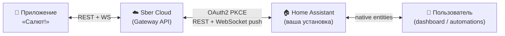

# SberHome for Home Assistant

[](https://hacs.xyz)
[](https://github.com/dzerik/ha-sberhome/releases)
[](https://github.com/dzerik/ha-sberhome/releases)
[](LICENSE)
[](tests/)
[](https://github.com/dzerik/ha-sberhome/actions/workflows/ci.yml)
[](https://github.com/dzerik/ha-sberhome/actions/workflows/hacs.yml)
[](https://github.com/dzerik/ha-sberhome/actions/workflows/hassfest.yml)
[](https://www.home-assistant.io)

[](https://my.home-assistant.io/redirect/hacs_repository/?owner=dzerik&repository=ha-sberhome&category=integration)

Нативная интеграция **Sber Smart Home** (приложение «Салют!») в Home Assistant.
Привозит устройства из экосистемы Сбер (свет, розетки, датчики, климат, шторы,
пылесосы, ТВ, домофоны, чайники) в HA через облачный API умного дома Сбера
(`gateway.iot.sberdevices.ru`) — тот, которым пользуется приложение «Салют!», —
с OAuth2/PKCE авторизацией через Сбер ID и WebSocket push для мгновенных
обновлений. Это не опубликованный публичный API: Сбер не документирует его для
сторонних клиентов и может изменить без предупреждения (см.
«[Известные ограничения](#известные-ограничения)»).

## 🔊 Работает в паре с SberBoom (`sboom_ha`)

Для **колонок Сбер** есть родственная интеграция
[**sboom_ha**](https://github.com/TohaRG2/sboom_ha) — локальное управление плеером
(медиа, громкость, каталог Звука) + Lovelace-карточка
[**ha-sboom-card**](https://github.com/dzerik/ha-sboom-card). Вместе они дают
**полный контроль над колонкой из одной карточки устройства**:

- **sberhome** (эта интеграция) — облачные настройки колонки: **эквалайзер**
  (пресеты «Ровный/Эмбиент/Басы/Голос», 5 полос), детские ограничения, звуковой
  отклик, режимы — по каналу `/v18`.
- **sboom_ha** — локальное воспроизведение, обложки, транспорт, поиск по каталогу.

Обе интеграции **автоматически сливаются в одно HA-устройство** колонки (общий
serial), а панель/карточка SberBoom показывает эквалайзер и настройки прямо под
обложкой. Управляйте настройками через **/v18-сущности** («Звуковой отклик»,
«Ограничения для детей/всех», «Детский профиль в музыке»); gateway-зеркала
(`sensor`/`binary_sensor`) — только для чтения.

## Благодарности

Отдельная благодарность проекту
[**altfoxie/ha-sberdevices**](https://github.com/altfoxie/ha-sberdevices) —
его находки по авторизации стали отправной
точкой для ha-sberhome. Мы вдохновились и переработали всё под своё
видение, но стоим у него на плечах.

В v5.1.0 добавлен **второй путь авторизации — через SMS-OTP** (beta).
**Механизм и алгоритм CSAFront-flow** (`/authenticate` → `/verify` →
`/oidc/v3/token` → `/v13/smarthome/token`) **взят полностью из
открытого источника — проекта
[shuryak/sberdevices](https://github.com/shuryak/sberdevices)** (Go,
MIT-license). Все endpoint'ы, заголовки, anti-bot `rsa_data` ритуал,
persistent `X-Device-ID`, шаги refresh-rotation — переиспользованы
оттуда без изменений по существу; портировано на Python/asyncio и
интегрировано в общий `aiosber`-стек. Огромная благодарность автору
открытой реализации — без неё бета-путь не появился бы.


> [!NOTE]
> Если вам, наоборот, нужно **выставить HA-устройства в Салют** (голосовое
> управление «Салют, включи свет»), посмотрите sister-проект
> **[sber-mqtt-bridge](https://github.com/dzerik/sber-mqtt-bridge)** —
> выставление HA → Сбер через MQTT-партнёрский API.

## Disclaimer

Этот проект:

- **не аффилирован** с ПАО Сбербанк, SberDevices, экосистемой «Салют»
  или любыми их дочерними структурами;
- работает **только с устройствами, принадлежащими конечному
  пользователю**, и **только под его собственной учётной записью**
  Sber Smart Home — авторизация всегда происходит от имени пользователя
  его собственными credentials (Sber ID OAuth через `id.sber.ru` либо
  SMS-OTP на привязанный к аккаунту телефон);
- обращается к облаку умного дома через **внутренний API приложения
  «Салют!»** (`gateway.iot.sberdevices.ru`, `ws.iot.sberdevices.ru`), для
  которого Сбер не публикует документацию; опубликованный Сбером API умного
  дома (C2C) предназначен для производителей устройств и решает обратную
  задачу;
- использует **публично задокументированный** Sber ID OAuth-flow
  (`id.sber.ru/CSAFront/oidc/authorize.do` + `/oidc/v3/token`) в
  качестве основного пути авторизации — тот же самый, что использует
  [официальный Sber ID iOS SDK](https://github.com/SberID/ios-sdk);
- для бета-режима SMS-OTP wire-format **взят из открытого MIT-проекта**
  [shuryak/sberdevices](https://github.com/shuryak/sberdevices) с явной
  атрибуцией; декомпиляция, дизассемблирование, обход технических
  средств защиты, перехват чужого трафика — **не использовались**;
- предоставляется **AS-IS, без гарантий**: Sber может в любой момент
  изменить или отозвать endpoint'ы, и интеграция перестанет работать
  до обновления;
- не имитирует виртуального ассистента «Салют» и не задействует его
  Voice/NLP-функции — реализует только функцию **management
  собственных устройств пользователя**, дополняющую штатное приложение,
  а не заменяющую его.

Полная правовая позиция — в [LEGAL.md](LEGAL.md) (ст. 1280 ГК РФ,
EU Software Directive 2009/24/EC, анализ публичных документов Sber).

Если вы считаете, что проект нарушает чьи-то права —
[откройте issue](https://github.com/dzerik/ha-sberhome/issues) или
напишите автору, мы оперативно прислушаемся.

Товарные знаки **Sber**, **SberDevices**, **Салют**, **SberHome**,
**SberBoom** принадлежат соответствующим правообладателям; их
упоминание в документации — **nominative use** для обозначения
совместимости.

## Как это работает


```mermaid
flowchart LR
    App["📱 Приложение\n«Салют!»"]
    Cloud["☁️ Sber Cloud\n(Gateway API)"]
    HA["🏠 Home Assistant\n(ваша установка)"]
    User["👤 Пользователь\n(dashboard / automations)"]

    App <-->|"REST + WS"| Cloud
    Cloud <-->|"OAuth2 PKCE\nREST + WebSocket push"| HA
    HA <-->|"native entities"| User
```

1. OAuth2 PKCE через `id.sber.ru` → получение «companion» токена, которым
   ходит мобильное приложение «Салют!».
2. Polling `GET /device_groups/tree` для discovery устройств и комнат.
3. WebSocket push `wss://ws.iot.sberdevices.ru` для real-time
   `DEVICE_STATE` (включение/выключение, изменение атрибутов
   датчиков) — polling снижается до 10 минут, пока WS жив.
4. HA ↔ Sber команды через `PUT /devices/{id}/state`.

## Возможности

- **🎙️ Voice Intents UI** — bidirectional bridge с Sber-сценариями.
  Создавай / редактируй / удаляй / запускай Sber-scenarios прямо из HA
  UI (вкладка «Voice Intents»). Schema-driven extensible форма, picker
  всех Sber-устройств без HA-enabled фильтра. Sber-сценарии фразой
  пробрасываются в HA как `sberhome_intent` event для автоматизаций.
  Подробности в секции [«Что нового в 4.x»](#что-нового-в-4x--examples).
- **30 категорий устройств** — полное покрытие Sber Gateway API
  (свет, розетки, реле, датчики темп/влажности/протечки/двери/движения/
  дыма/газа, шторы, ворота, клапаны, все HVAC, увлажнители, очистители,
  чайники, пылесосы, ТВ, сценарные кнопки, домофоны, хабы, **колонки
  SberBoom/Portal/Box/Satellite**).
- **Sber Cloud Scenarios → HA entities** — каждый твой Sber-сценарий
  (`/scenario/v2/scenario`) появляется как `button` (запустить),
  `switch` (вкл/выкл автосрабатывание) и **`event.sber_scenarios_<имя>`** —
  нативный device-триггер «сценарий сработал» в редакторе автоматизаций
  (альтернатива слушанию сырого `sberhome_intent` в YAML).
- **At-home presence (per-home)** — на каждый дом аккаунта свой
  `binary_sensor` + `switch` «At home (<дом>)»: зеркалит и пишет обратно
  переменную `at_home` конкретного дома. Используй как `condition` или
  `trigger` («когда пришёл домой»).
- **Группы устройств** — кастомные группы Sber (`group_type=GROUP`)
  доступны bulk-переключателем `switch.<группа>` и секцией «Группы» в
  панели (таб «Автоматизации»).
- **Sber LED indicator** — `light.sber_indicator_color` (HSV) управляет
  цветом и яркостью LED-кольца на колонках Сбера через `IndicatorAPI`.
- **Per-device firmware updates** — `update.<device>_firmware` per
  устройству показывает доступную версию прошивки из
  `/inventory/ota-upgrades` рядом с installed (sw_version). Когда
  Sber публикует обновление — золотой колокольчик в шапке HA.
  Установка управляется Sber-облаком (HA-side install не реализован).
- **Hub diagnostics** — для SberBoom Home / SberPortal / intercom
  координатор раз в час дёргает `/devices/{id}/discovery` и
  экспонирует `sensor.<hub>_subdevice_count` — сколько связанных
  через хаб устройств.
- **Opt-in picker** — устройства не создаются в HA автоматически; вы
  выбираете нужные во встроенной панели. Неподдерживаемые категории
  визуально приглушаются с бейджем «не поддерживается» и не
  включаются (server-side guard).
- **Real-time WebSocket push** — изменение состояния датчика в Сбер
  → мгновенно в HA (обычно <2 сек).
- **Adaptive polling** — когда WS активен, REST-опрос раз в 10 минут
  (только для discovery новых устройств и ренеймов); при обрыве WS
  возвращается к пользовательскому интервалу (default 30 сек).
- **Multi-cadence background polling** — сценарии каждые 5 минут,
  OTA / discovery / indicator каждый час (отдельно от device tree,
  чтобы не нагружать API). Best-effort: ошибка в одном potoke не
  валит остальные.
- **Опционные Zigbee-датчики** — реле/лампочки подтягивают
  Zigbee-сенсоры производителя (батарея, сигнал, tamper, alarm_mute).
- **Intercom-кнопки** `button.intercom_unlock` /
  `button.intercom_reject_call` — управление домофоном из HA.
- **Pairing WS surface** — 8 WS-команд поверх `PairingAPI` (Wi-Fi /
  Zigbee / Matter handshake) для будущего custom-panel «Add device»
  wizard. Полноценный config_flow UI пока не реализован, surface готов.
- **Встроенная панель DevTools** (вкладка Monitor в сайдбаре):
  - **State Diffs** — дельта `reported_state` вместо
    полного payload'а, чтобы увидеть что именно поменялось.
  - **Command Confirmation Tracker** — ловит silent rejection от Sber
    (HTTP 200 без применения команды) по отсутствию ключей в
    следующем `reported_state`.
  - **Schema Validation** — детектит API drift на лету.
  - **Replay / Inject** — подсунуть синтетический WS-пейлоад
    в coordinator для отладки без физического устройства.
  - **Per-device Diagnose** — один клик → вердикт
    `ok`/`warning`/`broken` + actionable next step.
- **Raw command debug** — сервис `sberhome.send_raw_command` для
  отправки произвольного `AttributeValueDto` в обход маппинга.
- **Reauth Flow** — автоматическое предложение повторной авторизации
  при истечении токена.
- **Options Flow** — интервал опроса API (10–3600 секунд), размер буферов
  DevTools и ожидание подтверждения команд (см.
  «[Параметры интеграции](#параметры-интеграции)»).
- **Diagnostics** — полный отчёт с редакцией токенов.
- **Локализация** — русский, английский, казахский, белорусский,
  узбекский.
- **1058 тестов** — unit + HA-integration (pytest +
  pytest-homeassistant-custom-component + respx).

## Поддерживаемые устройства (полный список)

**Освещение** — умные лампы (`light`), светодиодные ленты
(`led_strip`, + sleep_timer).

**Электрика** — умные розетки (`socket`, + напряжение/ток/мощность +
child_lock), реле (`relay`, + измерения).

**Датчики** — температуры/влажности/давления (`sensor_temp`),
протечки воды (`sensor_water_leak`), открытия двери/окна
(`sensor_door`, + tamper, sensitivity), движения (`sensor_pir`),
дыма (`sensor_smoke`), утечки газа (`sensor_gas`). Все — с
батареей, сигналом и low-battery флагом.

**Шторы / ворота** — `curtain`, `window_blind`, `gate`, `valve` —
open/close/position/open_rate. Двустворчатые — отдельные `_left` /
`_right` сущности.

**HVAC** — кондиционеры (`hvac_ac`), обогреватели (`hvac_heater`),
радиаторы (`hvac_radiator`), бойлеры (`hvac_boiler`), тёплый пол
(`hvac_underfloor_heating`), вентиляторы (`hvac_fan`), очистители
воздуха (`hvac_air_purifier`), увлажнители (`hvac_humidifier`) —
полное покрытие features spec: current + target temp, humidity,
fan speeds, hvac modes, air flow direction, night/ionization/
aromatization, water level/low diagnostics.

**Бытовая техника** — чайники (`kettle`), роботы-пылесосы
(`vacuum_cleaner`), телевизоры (`tv`, source/volume/channel/mute +
custom_key/direction/channel IR-style services).

**Другое** — сценарные выключатели (`scenario_button`, события
click/double_click/long_press для до 10 кнопок и directional-вариантов
+ виртуальные c2c-кнопки `cat_button_*` типа «Эмуляция присутствия»),
домофоны (`intercom`), хабы (`hub`), колонки/портал
(`sber_speaker` — SberBoom Home/Mini, СберБум 2.0/Aura, SberPortal, SberBox,
SberSatellite). Через REST у Sber-владельных колонок media-control недоступен
(это архитектурный лимит Gateway), но мы экспонируем connectivity +
Zigbee/Matter readiness + position select + LED-индикатор. У «СберБум 2.0»
(Aura) дополнительно есть встроенный радар присутствия
(`binary_sensor` presence + диагностический флаг его включённости) и статус
звонка (`sensor`).

## Типы сущностей в Home Assistant (полный список)

Интеграция создаёт сущности **16 HA-платформ** (доменов). Ниже — что каждый
домен представляет и пример `entity_id`.

| Домен | Что представляет | Пример |
|---|---|---|
| `light` | лампы, LED-ленты, LED-индикатор (кольцо) колонок | `light.spalnya_lampa`, `light.sber_indicator_color` |
| `switch` | розетки, реле, чайник вкл, child_lock, alarm_mute, **«Я дома»**, **Sber-группы**, «сценарий активен» | `switch.kuhnya_rozetka`, `switch.sber_at_home`, `switch.sber_groups_vytyazhki` |
| `sensor` | температура/влажность/давление/батарея/сигнал, вода/энергия, статусы техники | `sensor.spalnya_temperatura` |
| `binary_sensor` | протечка/движение/дым/газ/дверь-окно, online, tamper, low-battery, **«Я дома»** | `binary_sensor.koridor_dvizhenie`, `binary_sensor.sber_at_home` |
| `number` | таймер сна, целевые значения (яркость/температура/влажность), open_rate штор | `number.uvlazhnitel_tselevaya_vlazhnost` |
| `select` | режимы/чувствительность/программы/источник/направление воздуха | `select.pylesos_programma` |
| `climate` | HVAC: кондиционеры, обогреватели, радиаторы, бойлеры, тёплый пол | `climate.gostinaya_konditsioner` |
| `cover` | шторы, жалюзи, ворота, клапаны (open/close/position) | `cover.spalnya_shtory` |
| `fan` | вентиляторы, очистители воздуха | `fan.ochistitel` |
| `humidifier` | увлажнители (target humidity + режимы) | `humidifier.detskaya` |
| `media_player` | телевизоры (source/volume/channel/mute) | `media_player.tv_gostinaya` |
| `vacuum` | роботы-пылесосы (старт/пауза/док/зоны/программы) | `vacuum.robot` |
| `button` | **запуск Sber-сценария**, домофон, ручной refetch устройства | `button.sber_scenarios_uhod_iz_doma` |
| `event` | **голосовые срабатывания** сценариев, scenario-кнопки (click/double/long) | `event.sber_scenario_marker_odin` |
| `notify` | **TTS-суррогат** (озвучка) + **TTC-суррогат** (команда ассистенту) per home | `notify.moi_dom_sber_tts_moi_dom`, `notify.moi_dom_sber_ttc_moi_dom` |
| `update` | обновления прошивки устройств | `update.lyustra_proshivka` |

### Нематериальные сущности (двусторонняя интеграция HA ↔ Sber)

Помимо физических устройств интеграция маппит «нематериальные» сущности Sber:

- **Sber-сценарии** → `button.sber_scenarios_*` (программный запуск) + `event.*`
  (ловля голосовых/любых срабатываний). Создание/редактирование — из панели.
- **«Я дома» (at_home)** — per home: `switch.sber_at_home` (запись) и
  `binary_sensor.sber_at_home` (чтение). «Я на даче» ≠ «я дома» — по каждому дому свой.
- **Sber-группы устройств** → `switch.*` под устройством «Sber Groups».
- **LED-индикатор колонок** → `light.sber_indicator_color` (окрасить кольцо из HA).
- **TTS / TTC** → `notify.*` (озвучить текст / выполнить команду ассистенту).
- **Настройки колонок** (канал `/v18`) → эквалайзер/светомузыка/яркость LED/детские
  режимы как `select`/`number`/`switch` (вкладка «Колонки» в панели).

### Категория устройства → создаваемые платформы

30 категорий устройств (60 вариантов `image_set_type`) раскладываются так:

| Категория | Платформы |
|---|---|
| `light` | light |
| `led_strip` | light · number · switch |
| `socket`, `relay` | switch · sensor |
| `sensor_temp`, `sensor_air` | sensor · select |
| `sensor_water_leak` | binary_sensor |
| `sensor_door`, `sensor_pir` | binary_sensor · select |
| `sensor_smoke` | binary_sensor · switch |
| `sensor_gas` | binary_sensor · switch · select |
| `curtain`, `gate` | cover · select |
| `window_blind` | cover · select · number |
| `valve` | cover |
| `hvac_ac` | climate · switch · number · select |
| `hvac_heater`, `hvac_boiler`, `hvac_underfloor_heating` | climate · select |
| `hvac_radiator` | climate |
| `hvac_fan` | fan · select |
| `hvac_air_purifier` | fan · switch · binary_sensor |
| `hvac_humidifier` | humidifier · sensor · binary_sensor · switch |
| `kettle` | switch · number · sensor · binary_sensor |
| `vacuum_cleaner` | vacuum · select · switch |
| `tv` | media_player |
| `scenario_button` | event |
| `intercom` | binary_sensor · button |
| `hub` | binary_sensor |
| `sber_speaker` | binary_sensor · light · select · sensor |

Незнакомые категории получают generic-фолбэк (сенсоры из reported-состояния),
поэтому новое устройство не остаётся «пустым».

## Что нового в 4.x — examples

### 🎙️ Voice intents — bidirectional bridge с Sber-сценариями

Главная фича 4.x: **двустороннее управление Sber-сценариями из HA + ловля
голосовых команд через Sber-колонку как HA event'ы**. Не нужно мобильное
приложение «Салют!» для типичных сценариев — вся работа из вкладки
«Voice Intents» в SberHome panel.

#### Что умеет

- **Создавать / редактировать / удалять Sber-сценарии прямо из HA UI.**
  Schema-driven форма: имя + триггеры (голосовые фразы / расписание /
  состояние устройства) + actions (TTS / команда устройству /
  команда ассистенту текстом на колонку / включить-выключить другой
  сценарий / SMS / push / HA-event-only).
- **Запустить сценарий по кнопке** (▶ Test) — реальный программный run
  через `POST /scenario/v2/scenario/{id}/run` (то же что кнопка
  «Запустить действие» в Sber-приложении). Колонка озвучит TTS,
  выполнит device-команду, и т.п.
- **Ловить срабатывания** через `sberhome_intent` HA event — для любого
  Sber-сценария (включая созданные руками в мобилке). Без виртуальных
  кнопок-посредников: подписан на `scenario_widgets` WS-топик,
  получает push при каждом срабатывании, дёргает `/scenario/v2/event`
  для metadata, fire'ит HA event.
- **Picker колонок не ограничен HA enabled-set**. При выборе устройства
  для TTS-action виден весь Sber-side list (даже колонки не подключённые
  в HA через picker) — Sber выполнит сценарий в облаке, HA-import не
  нужен.
- **Live `last_fired_at`**. В UI видно когда последний раз сценарий
  сработал, обновляется real-time через event-bus subscription.
- **Forward-compat для незнакомых Sber-actions** (новые task types,
  RegimeCommand и т.п.) — UI помечает «sber-only» и сохраняет
  raw_extras при update без потерь.

#### Где найти в HA UI

```
HA → SberHome (sidebar) → вкладка Voice Intents
┌────────────────────────────────────────────────────────────┐
│ Воice Intents                          [+ Новый intent]    │
├────────────────────────────────────────────────────────────┤
│ Утренний кофе                          🔥 2 мин назад      │
│ «утренний кофе», «сделай кофе»                             │
│ tts                          [▶ Test] [✎] [🗑]             │
├────────────────────────────────────────────────────────────┤
│ Холодно                                ── Sber-only ──     │
│ «Холодно»                                                  │
│ trigger_notify              [▶ Test] [✎] [🗑]              │
└────────────────────────────────────────────────────────────┘
```

#### Use-case: голосовая команда → HA автоматизация

```yaml
# automations.yaml — сценарий «Маркер один» создан в Sber-приложении
# или через нашу UI-вкладку (с любыми actions: TTS, push, ничего)
automation:
  - alias: HA reacts to Sber voice intent
    trigger:
      - platform: event
        event_type: sberhome_intent
        event_data:
          name: "Маркер один"
    action:
      - service: notify.persistent_notification
        data:
          message: "Sber-сценарий «{{ trigger.event.data.name }}» сработал!"
          title: Voice intent caught
```

Payload event'а: `{name, scenario_id, event_time, type, account_id, simulated}`.

`simulated: true` маркирует HA-side test-симуляции — реальные срабатывания
от голоса колонки имеют `simulated: false` (или поле отсутствует).

Latency end-to-end (произнесение фразы → trigger в HA): **~300-500 мс**.

#### Use-case: HA-автоматизация → колонка озвучивает текст

Нет прямого «say arbitrary text» REST-API в Sber Gateway, но есть
работающий путь через named-сценарий:

1. В UI вкладке **Voice Intents** создаёшь intent например «уведомление
   о температуре»: action = TTS «Включаю обогрев», device = SberBoom Home.
2. В HA-автоматизации триггеришь Sber-сценарий через `sberhome.run_scenario`
   service (запускает через REST). Колонка озвучит фразу.

```yaml
automation:
  - alias: Heater on when cold
    trigger:
      - platform: numeric_state
        entity_id: sensor.living_room_temp
        below: 18
    action:
      # Запустить Sber-сценарий «Включаю обогрев» (создан в UI)
      - service: button.press
        target:
          entity_id: button.sber_scenarios_vklyucayu_obogrev
      - service: switch.turn_on
        target:
          entity_id: switch.heater
```

Проще — через **TTS-суррогат** (`notify`-сущность per home, вкладка «🔊 Озвучка»):

```yaml
automation:
  - alias: Озвучить температуру на колонке
    trigger:
      - platform: state
        entity_id: binary_sensor.hallway_motion
        to: "on"
    action:
      - service: notify.send_message
        target:
          entity_id: notify.moi_dom_sber_tts_moi_dom
        data:
          message: "В коридоре движение, температура {{ states('sensor.hall_temp') }} градусов"
```

#### Use-case: HA-автоматизация → колонка ВЫПОЛНЯЕТ команду ассистенту (TTC)

**TTC-суррогат** (вкладка «🎙 Команда»): колонка исполняет текст как голосовую
команду ассистенту — «Расскажи анекдот», «Включи радио», «Поставь таймер на
5 минут», «Какая погода».

```yaml
automation:
  - alias: Утренний ритуал — колонка ставит музыку
    trigger:
      - platform: time
        at: "07:30:00"
    action:
      - service: notify.send_message
        target:
          entity_id: notify.moi_dom_sber_ttc_moi_dom
        data:
          message: "Включи бодрую музыку"
```

> Не используй зарезервированные слова ассистента как **триггер-фразу** сценария
> («Новости», «Погода», «Время»…) — их перехватывает встроенный навык. Для команд
> внутри TTC это не ограничение: там текст и есть команда ассистенту.

#### WS-эндпоинты (для custom panel/cards)

```javascript
// Список intent'ов
await hass.callWS({ type: "sberhome/intents/list" });

// Schema для динамической UI-формы (action types + fields)
await hass.callWS({ type: "sberhome/intents/schema" });

// Picker устройств (без HA-enabled фильтра)
await hass.callWS({
  type: "sberhome/intents/devices_for_picker",
  category: "sber_speaker"
});

// Create / update / delete / get / test
await hass.callWS({
  type: "sberhome/intents/create",
  spec: {
    name: "Утренний кофе",
    phrases: ["утренний кофе", "сделай кофе"],
    actions: [{ type: "tts", data: {
      phrase: "Запускаю!", device_ids: ["d7l4..."]
    }}]
  }
});
await hass.callWS({
  type: "sberhome/intents/test",
  intent_id: "sc-1"
});
```

#### Расширяемость (для разработчиков)

Backend `intents/registry.py` использует ActionRegistry pattern — добавить
новый action_type = одна запись + 2 функции (encode/decode). UI получит
новую option автоматически через `intents/schema`. Добавить новый
field type в форме (например `slider`, `color_picker`) = ~20 строк JS
в `_renderInputForType` в `sberhome-intent-modal.js`.

Forward-compat: незнакомые поля Sber wire-формата сохраняются в
`IntentSpec.raw_extras` и мерджатся обратно при update. Sber может
добавить новое поле — наш код не упадёт. Пользователь создал в мобилке
сценарий с экзотическим action типом — UI пометит как «complex/read-only»,
raw сохраняется и не теряется.

### Sber-сценарии как HA buttons

Каждый сценарий из мобильного приложения «Салют!» появляется в HA как
button под virtual-устройством **«Sber Scenarios»**:

```yaml
# Пример automation: запустить Sber-сценарий «Уход из дома»,
# когда HA-датчик подтвердил отсутствие
automation:
  - alias: Sber Goodbye on HA away
    trigger:
      - platform: state
        entity_id: binary_sensor.someone_home
        to: "off"
        for: "00:05:00"
    action:
      - service: button.press
        target:
          entity_id: button.sber_scenarios_uhod_iz_doma
```

### At-home presence как HA condition / trigger

```yaml
# Пример: включаем свет в коридоре только если at_home == true
automation:
  - alias: Hallway light when at home
    trigger:
      - platform: state
        entity_id: binary_sensor.hallway_motion
        to: "on"
    condition:
      - condition: state
        entity_id: binary_sensor.sber_at_home
        state: "on"
    action:
      - service: light.turn_on
        target:
          entity_id: light.hallway

# Зеркальный поток: устанавливаем at_home из HA
automation:
  - alias: Set Sber at_home when arriving
    trigger:
      - platform: state
        entity_id: device_tracker.my_phone
        to: "home"
    action:
      - service: switch.turn_on
        target:
          entity_id: switch.sber_at_home
```

### LED-индикатор колонок из HA

```yaml
# Пример: окрасить кольцо на колонке в красный когда сработал датчик дыма
automation:
  - alias: Red ring on smoke alarm
    trigger:
      - platform: state
        entity_id: binary_sensor.kitchen_smoke
        to: "on"
    action:
      - service: light.turn_on
        target:
          entity_id: light.sber_indicator_color
        data:
          hs_color: [0, 100]
          brightness: 255
```

### Firmware updates как HA notifications

`update.<device>_firmware` per устройству **выключен по умолчанию** в
registry — слишком много шума, если включать всем 50 датчикам. Включи
вручную для тех устройств, прошивку которых хочешь tracked:

> **Settings → Devices & services → SberHome → нажми устройство →**
> «+1 hidden entity» → toggle `Firmware`.

Когда в Sber появляется обновление — HA отрисует золотой колокольчик в
шапке. Сама установка — через мобильное приложение Сбер (server-side
rollout, HA-side install не реализован).

### Hub sub-device counter

Для SberBoom Home / SberPortal / intercom создаётся диагностический
`sensor.<hub>_subdevice_count` — сколько устройств связано через этот
хаб. Полезно для проверки «всё ли видит хаб после рестарта» (Zigbee
драйверы иногда забывают peer'ов).

### WebSocket API для custom Lit-cards / panel-extensions

Все API-домены `aiosber` доступны через `coordinator.client`:

```javascript
// В custom panel или HACS-карте
const rooms = await hass.callWS({ type: "sberhome/get_rooms" });
await hass.callWS({
  type: "sberhome/rename_room",
  room_id: "g-1",
  name: "Гостиная",
});

// Pairing flow surface (для будущего Add-device wizard)
const creds = await hass.callWS({
  type: "sberhome/pairing/wifi_credentials",
});
await hass.callWS({
  type: "sberhome/pairing/start",
  pairing_type: "wifi",
  image_set_type: "dt_bulb_e27_m",
  timeout: 60,
});

// Manual refresh после временной сетевой ошибки
await hass.callWS({ type: "sberhome/refresh_scenarios" });
await hass.callWS({ type: "sberhome/refresh_ota" });
```

## Установка

### Через HACS (кнопка)

Кликните бейдж в начале README, либо: HACS → ⋮ → **Custom repositories** →
URL: `https://github.com/dzerik/ha-sberhome`, Category: *Integration*.

### Вручную

Скопируйте `custom_components/sberhome/` в `custom_components/` вашей
конфигурации HA и перезапустите.

## Настройка

Интеграция добавляется одна на Home Assistant: **Настройки** → **Устройства и
службы** → **Добавить интеграцию** → **SberHome**. Первый шаг — выбор способа
входа:

- **Сбер ID (через браузер, рекомендуем)**;
- **Номер телефона + SMS-код (бета)**.

Оба способа входят в один и тот же аккаунт Сбера — тот, к которому в
приложении «Салют!» добавлены ваши устройства. Перед созданием записи
интеграция получает токен умного дома и делает пробный запрос к облаку
(список домов аккаунта). Если облако недоступно или не приняло вход, форма
показывает ошибку, и шаг можно повторить; запись без работающего подключения
не создаётся.

После входа **устройства не импортируются автоматически**: откройте панель
**SberHome** в боковом меню и отметьте нужные устройства. Пока не отмечено ни
одно, запись подключена, но сущностей (включая сценарии, «Я дома» и
уведомления TTS/TTC) не создаёт.

### Вход через Сбер ID

1. Выберите **Сбер ID**. Home Assistant откроет в новой вкладке свою страницу
   `/auth/sberhome` с инструкцией. Для этого в Home Assistant должен быть
   задан внешний или внутренний адрес (**Настройки → Система → Сеть**), иначе
   настройка прерывается с сообщением «Не настроен доступный URL Home
   Assistant».
2. Нажмите **«Войти через Сбер ID»** и войдите в аккаунт Сбера.
3. После входа браузер покажет ошибку открытия адреса `companionapp://…` — это
   нормально: так Сбер возвращает код авторизации мобильному приложению.
   Скопируйте этот адрес из адресной строки. Если в адресной строке его нет,
   откройте консоль разработчика (F12) и скопируйте ссылку
   `companionapp://…` из текста ошибки.
4. Вернитесь на страницу `/auth/sberhome`, вставьте адрес и нажмите
   **«Подтвердить»**. Завершите вход в течение 10 минут; код из адреса
   одноразовый.

Что вводится:

| Поле | Что это и где взять |
|---|---|
| Адрес `companionapp://…` | Адрес, на который Сбер ID перенаправляет после входа. Содержит одноразовый параметр `code=…`. Кнопка «Подтвердить» активна, только если вставленный текст начинается с `companionapp://`. |

### Вход по SMS (бета)

1. Выберите **Номер телефона + SMS-код**.
2. **Номер телефона** — номер аккаунта Сбера, к которому добавлены устройства
   умного дома. Допустимы пробелы, скобки, дефисы и начало `+7` или `8`:
   `+7 (900) 123-45-67`, `8 900 123 45 67`, `79001234567`. Десять цифр без
   кода страны дополняются `7`, номер с `8` в начале из 11 цифр переводится в
   `7…`. После ввода Сбер отправляет SMS с одноразовым кодом.
3. **Код из SMS** — код из сообщения. Если код не пришёл или истёк, отметьте
   **«Отправить новый код»** и отправьте форму с пустым полем кода — новый код
   придёт на тот же номер.

Запись получает название `SberHome (SMS · <номер>)`.

### Какие токены получает интеграция и где они хранятся

| Способ входа | Что сохраняется в записи |
|---|---|
| Сбер ID | Токены Сбер ID (access, refresh и id_token) и **companion-токены** — токен умного дома, на который Сбер обменивает вход через Сбер ID; с ним работает приложение «Салют!», им подписываются запросы к облаку умного дома. Токен Сбер ID нужен ещё и для настроек колонок. |
| SMS | Токены входа по SMS (access и refresh), токен умного дома, случайный идентификатор клиента, созданный при входе, и номер телефона (для повторного входа). |

- Логин, пароль и код из SMS **не сохраняются**.
- Токены хранятся только в Home Assistant — в данных записи интеграции, в
  файле `config/.storage/core.config_entries`. Как и данные любых записей
  Home Assistant, они не шифруются и попадают в резервные копии — храните
  копии соответственно. В диагностике интеграции токены скрыты.
- Токены обновляются автоматически, refresh-токен при этом каждый раз
  заменяется новым, и запись сохраняет новый.
- Аккаунт записи запоминается (для Сбер ID — идентификатор аккаунта из
  id_token, для SMS — номер телефона). При повторном входе принимается только
  тот же аккаунт.

### Повторный вход

Если облако перестало принимать токены, в **Настройки → Устройства и
службы** появляется запрос **«Повторная авторизация»**. Он открывает тот же
способ входа, что был при настройке: для SMS номер телефона уже подставлен.
Вход в другой аккаунт Сбера отклоняется («Вход выполнен с другим
Sber-аккаунтом»), а номер, отличный от номера записи, — ещё до отправки SMS.
Сменить способ входа (Сбер ID ↔ SMS) можно только удалив запись и добавив
интеграцию заново.

## Параметры интеграции

**Настройки → Устройства и службы → SberHome → Настроить**. Те же три
параметра меняются во вкладке **Settings** панели SberHome. Изменения
применяются сразу, без перезагрузки записи.

| Параметр | По умолчанию | Диапазон | Что делает |
|---|---|---|---|
| **Интервал опроса (секунды)** (`scan_interval`) | 30 | 10–3600 | Как часто запрашивать список устройств и их состояния из облака, пока WebSocket не подключён. Пока WebSocket подключён, состояния приходят сразу, а облако опрашивается раз в 10 минут независимо от этого параметра. Если облако ответило «слишком много запросов», следующий опрос откладывается на указанный облаком срок (без срока — на минуту, не больше часа). |
| **Размер буферов DevTools** (`devtools_buffer_size`) | 200 | 10–5000 | Сколько записей хранит каждый журнал DevTools в панели: сообщения WebSocket, изменения состояний, команды, замечания проверки схемы. Журналы хранятся в памяти и сбрасываются при перезапуске. |
| **Ожидание подтверждения команды (секунды)** (`command_timeout`) | 10 | 1–120 | Сколько ждать, пока устройство сообщит отправленное состояние, прежде чем DevTools в панели пометит команду неподтверждённой. На выполнение команды не влияет. |

Остальное настраивается не в этой форме:

- **Выбор устройств** — в панели SberHome (вкладка Devices). Изменение выбора
  перезагружает запись.
- **Голосовые команды и слушатели из YAML** — секция `sberhome:` в
  `configuration.yaml`, см. [USAGE.md → YAML-конфигурация](USAGE.md#yaml-конфигурация).
  Фоновые опросы сценариев (раз в 5 минут), прошивок, хабов и индикатора
  (раз в час) не настраиваются.

## Удаление

1. **Настройки → Устройства и службы → SberHome** → меню записи (⋮) →
   **Удалить**.
2. Если в `configuration.yaml` есть секция `sberhome:` (голосовые команды,
   слушатели), удалите её.
3. Чтобы удалить и файлы интеграции: **HACS** → SberHome → ⋮ →
   **Удалить**, либо вручную удалите папку `custom_components/sberhome`.
   Перезапустите Home Assistant.

Что происходит при удалении записи:

- Home Assistant удаляет запись вместе с сохранёнными токенами, а также
  устройства и сущности SberHome. Устройство колонки, объединённое с
  интеграцией `sboom_ha`, остаётся с сущностями `sboom_ha`. Панель SberHome
  пропадает из бокового меню.
- **В облаке Сбера ничего не удаляется и не отключается.** Устройства, дома и
  комнаты остаются в приложении «Салют!». Интеграция не отзывает токены на
  стороне Сбера — она просто перестаёт ими пользоваться.
- Сценарии, созданные интеграцией, остаются в облаке, их нужно удалить в
  приложении «Салют!» вручную: сценарии-заготовки `Sber TTS surrogate (<дом>) [home_id=…]`
  и `Sber TTC surrogate (<дом>) [home_id=…]`, голосовые команды из
  `configuration.yaml` и голосовые сценарии, созданные в панели (Automations →
  Scenarios).

Одно устройство убирается из Home Assistant снятием отметки в панели
SberHome: запись устройства удаляется из реестра, а в приложении «Салют!»
устройство остаётся.

## Решение проблем

Подробности почти любой ошибки видны в журнале. Включите отладочный журнал:
**Настройки → Устройства и службы → SberHome → ⋮ → Включить отладочное
журналирование** (или `logger:` → `custom_components.sberhome: debug` в
`configuration.yaml`). Для issue приложите диагностику: **⋮ → Скачать
диагностику** — токены в ней скрыты.

### Настройка не открывает страницу входа Сбер ID

Сообщение «Не настроен доступный URL Home Assistant»: страница входа
открывается по адресу Home Assistant, а он не задан. Задайте внешний или
внутренний адрес в **Настройки → Система → Сеть** и начните настройку заново.
Браузер, в котором вы входите, должен открывать Home Assistant по этому адресу.

### Страница `/auth/sberhome` не принимает адрес

- **Кнопка «Подтвердить» неактивна** — вставлен не тот адрес. Нужен адрес,
  начинающийся с `companionapp://`, со страницы ошибки после входа.
- **«URL не содержит код авторизации»** — вход в Сбер ID не завершён или
  скопирован адрес без параметра `code=`. Войдите заново и скопируйте адрес
  целиком.
- **«Ошибка авторизации. Код мог устареть — попробуйте заново.»** — код
  одноразовый и живёт недолго. Нажмите «Войти через Сбер ID» ещё раз и
  вставьте новый адрес.
- **«Flow not found or already completed»** — окно настройки закрыто или
  прошло больше 10 минут. Начните добавление интеграции заново.

### «Не удалось проверить подключение к умному дому»

Вход через Сбер ID прошёл, но облако умного дома с полученным токеном не
ответило. Отправьте форму ещё раз: если облако было недоступно, проверка
повторится с тем же входом, если вход отклонён — снова откроется Сбер ID.
Если ошибка повторяется, проверьте, что Home Assistant открывает хосты из
раздела «[Сеть](#сеть)».

### Ошибки входа по SMS

- **«Некорректный номер»** — в номере меньше 10 или больше 15 цифр.
- **«Не удалось отправить SMS»** — облако Сбера не приняло запрос кода или
  не ответило. Проверьте номер и повторите позже.
- **«Код из SMS неверный или просрочен»** — введите код ещё раз или отметьте
  «Отправить новый код».
- **«Не удалось подключиться»** / **«Неверные данные авторизации»** — облако
  не выдало или не приняло токен умного дома. Отправьте форму ещё раз: если
  код уже принят, повторится только проверка облака. Если после этого форма
  сообщит, что код неверный или просрочен, отметьте «Отправить новый код».

### Запрос «Повторная авторизация»

Облако отвергло сохранённые токены, и обновить их не удалось. Сущности
недоступны, пока вы не войдёте снова. Откройте запрос в **Настройки →
Устройства и службы** и пройдите вход тем же способом и в тот же аккаунт. Сообщение «Вход
выполнен с другим Sber-аккаунтом» означает, что вы вошли не в тот аккаунт.

### Запись SberHome не загружается, Home Assistant повторяет настройку

При запуске Home Assistant или перезагрузке записи облако Сбера не ответило
на первый опрос. Home Assistant сам повторяет настройку через некоторое
время. Проверьте доступ в интернет и хосты из раздела
«[Сеть](#сеть)».

### Сущности недоступны, в журнале «Облако Сбера недоступно»

Опрос облака не прошёл: в журнале одна запись `Облако Сбера недоступно,
сущности SberHome недоступны: <причина>`, при восстановлении — `Связь с
облаком Сбера восстановлена`. Сущности становятся доступными после первого
удачного опроса или изменения по WebSocket. Если сбоев подряд пять и больше,
в **Настройки → Ремонт** появляется «SberHome не может обновить устройства» с
последней ошибкой; оно пропадает само после удачного опроса. Если в ошибке
упоминается авторизация — пройдите повторный вход. Кнопка «Обновить» в
панели или действие `sberhome.refresh` запускают опрос сразу.

### «Облако Сбера ограничило частоту запросов»

Облако ответило HTTP 429. Опрос откладывается на указанный облаком срок, в
журнале одно предупреждение со временем следующей попытки, а действия в это
время завершаются ошибкой «Облако Сбера ограничило частоту запросов».
Подождите. Не ставьте интервал опроса меньше необходимого и не вызывайте TTS
чаще раза в минуту; отключите другие интеграции, работающие с тем же
аккаунтом.

### Состояния обновляются с задержкой, в журнале «WebSocket-соединение недоступно»

Сообщение `WebSocket-соединение с облаком Сбера недоступно, изменения
устройств приходят только опросом` означает, что мгновенные обновления не
приходят и состояния обновляются с интервалом опроса (по умолчанию 30 с).
Переподключение идёт автоматически, при восстановлении пишется
`WebSocket-соединение с облаком Сбера восстановлено`. Проверьте доступ к
`ws.iot.sberdevices.ru`.

### «SberHome отключил часть фоновых обновлений»

Опрос сценариев, прошивок, хабов, индикатора или настроек колонок завершился
ошибкой и остановлен (названия опросов перечислены в сообщении). Управление устройствами работает. Нажмите **«Обновить»** в панели
SberHome или перезагрузите запись.

### «Обнаружена другая интеграция Sber»

Одновременно включена интеграция `sberdevices` с тем же аккаунтом. Две
интеграции перехватывают обновления друг друга. Оставьте включённой одну из
них.

### «Несколько записей SberHome: панель управляет только одной»

Остались записи, созданные до ограничения «одна запись». Удалите лишние в
**Настройки → Устройства и службы → SberHome**. Для другого аккаунта удалите
все записи и добавьте интеграцию заново.

### После настройки нет ни одной сущности

Так и задумано: откройте панель SberHome и отметьте устройства. Новые
устройства из приложения «Салют!» появляются в панели после очередного опроса
облака (при подключённом WebSocket — до 10 минут) или по кнопке «Обновить».

### Действие завершается ошибкой «Облако Сбера отказало в доступе к объекту»

Объект (обычно сценарий) удалён или недоступен в приложении «Салют!».
Интеграция перечитает данные аккаунта, сущность удалённого сценария станет
недоступной.

### Нет настроек колонок (эквалайзер, детские ограничения)

- При входе по SMS настроек колонок нет: для них нужен токен Сбер ID. Чтобы
  они появились, удалите запись и добавьте интеграцию через Сбер ID.
- При входе через Сбер ID запись в журнале `Настройки колонок недоступны для
  этого входа — отключаю домен` означает, что облако отказало в доступе к
  настройкам колонок. Они отключаются до перезагрузки записи; перезагрузите
  запись, а если отказ повторяется — пройдите вход заново.

### Команда в DevTools помечена неподтверждённой

Устройство не сообщило отправленное состояние за «Ожидание подтверждения
команды». Устройство может быть не в сети, медленно отвечать или молча
отклонить значение. Проверьте устройство в приложении «Салют!»; для медленных
устройств увеличьте параметр.

### Сеть

Home Assistant должен иметь доступ по HTTPS к хостам:

- `online.sberbank.ru` (порты 443 и 4431) — вход через Сбер ID и по SMS,
  обновление токенов;
- `companion.devices.sberbank.ru` — companion-токен и настройки колонок;
- `mp-prom.salutehome.ru` — токен умного дома при входе по SMS;
- `gateway.iot.sberdevices.ru` — устройства, сценарии, команды;
- `ws.iot.sberdevices.ru` — WebSocket с мгновенными обновлениями.

Сертификаты части хостов Сбера выпущены Russian Trusted Root CA. Этот
корневой сертификат встроен в интеграцию, устанавливать его в систему не
нужно.

## Известные ограничения

- **Неофициальный API.** Интеграция работает через облачный API умного дома,
  которым пользуется приложение «Салют!» (`gateway.iot.sberdevices.ru`,
  `ws.iot.sberdevices.ru`). Сбер не публикует документацию этого API для
  сторонних клиентов (опубликованный API умного дома Сбера — для производителей
  устройств, он решает обратную задачу). Для пользователя это значит:
  - Сбер может без предупреждения изменить или закрыть API, и часть функций
    или вся интеграция перестанет работать до выхода обновления;
  - поддержки со стороны Сбера нет — о проблемах пишите в
    [issues проекта](https://github.com/dzerik/ha-sberhome/issues);
  - интеграция обращается к облаку с идентификатором клиента и User-Agent
    приложения «Салют!»; облако ограничивает частоту запросов (HTTP 429).
- **Только облако.** Локального управления нет: без интернета или при сбое
  облака Сбера устройства недоступны и не управляются.
- **Один аккаунт Сбера на Home Assistant.** Вторую запись добавить нельзя.
  Все дома этого аккаунта поддерживаются.
- **Вход по SMS — бета.** При входе по SMS недоступны настройки колонок.
  Сменить способ входа можно только удалив и добавив запись заново.
- **Устройства не добавляются сами.** Их нужно отметить в панели; сценарии,
  группы и новые устройства появляются как сущности после перезагрузки записи
  (происходит и при изменении выбора устройств в панели).
- **Прошивки не устанавливаются из Home Assistant** — обновление только
  показывает доступную версию, установкой управляет облако Сбера.
- **TTS/TTC** работают через сценарий-заготовку в облаке: 2–3 запроса на
  вызов, задержка до 2 секунд, не для частых уведомлений (подробнее —
  «[Лимиты](#лимиты)»).
- **Добавление новых устройств** (Wi-Fi, Zigbee, Matter) выполняется в
  приложении «Салют!», из Home Assistant — нет.

## Light effects + Sber-группы (v5.4.0+)

### Эффекты на лампах

Если firmware лампы/ленты поддерживает динамические сцены, HA автоматически
подключает effect-feature. Запуск из автоматизации:

```yaml
- service: light.turn_on
  target:
    entity_id: light.lenta_zal
  data:
    effect: "Радуга"
```

Полный список доступных эффектов виден в `light.effect_list` (Lovelace
отображает их в стандартной light-card dropdown'ом). Эффект включается
только если в `attributes[].light_mode.enum_values` устройства есть
значение `scene` — лампы без поддержки сцен EFFECT-feature не получают.

Если передать неизвестное имя эффекта — в лог уйдёт warning, лампа
включится обычным `turn_on` (без сцены).

### Sber-группы как switch entities

Каждая user-created группа в приложении «Салют!» (например «Освещение
прихожей») появляется в HA как `switch.<group_name>`. Toggle
отправляет одну bulk-команду в Sber — Sber серверной стороной разъезжает
её по всем устройствам группы (быстрее и атомарнее, чем N отдельных
команд из HA). Пустые группы (без устройств) в HA не появляются.

Aggregated state:

- `is_on=True` — если хоть одно устройство группы включено;
- `is_on=False` — если все on_off-устройства группы выключены;
- `is_on=None` (unknown) — если в группе вообще нет устройств с атрибутом
  `on_off` (например, группа из штор/датчиков).

`available=False` если все устройства группы offline.

## TTS surrogate — произношение через Sber-колонки (v5.6.0+, 🧪 EXPERIMENTAL)

> **🧪 EXPERIMENTAL.** Каждый вызов = 2–3 API-call'а в облако Sber.
> Не для частых уведомлений (>1/мин). Sber может изменить wire-формат
> или начать лимитировать.

Для каждого дома Sber регистрируется HA-entity
`notify.<дом>_sber_tts_<дом>`. Вызов:

```yaml
automation:
  - alias: "Уведомление об ужине"
    trigger:
      platform: time
      at: "19:00:00"
    action:
      - service: notify.send_message
        target:
          entity_id: notify.moi_dom_sber_tts_moi_dom
        data:
          message: "Ужин готов"
```

Под капотом: интеграция находит (или создаёт) один Sber-сценарий-болванку
per home с маркером в description, PUT'ит `pronounce_data.phrase` +
`device_ids`, POST /run. Sber произносит фразу через указанные колонки.

### Управление и тестирование через UI

Открой панель SberHome → вкладка **Automations** → segment **🔊 TTS**:

- Статус surrogate-сценариев per home (создан / не создан, кнопка
  «Создать сейчас»).
- Тестовая форма: дом, фраза, выбор колонок. Показывает реальный
  latency после вызова.
- Автогенерированный YAML-сниппет для копи-пасты в `configuration.yaml`.

### Выбор колонок

По умолчанию — все колонки указанного дома (тип `sber_speaker` через
`image_set_type` / `full_categories[0].slug`).

Override — через `data.device_ids` (raw Sber UUIDs, можно найти в
UI-табе или в device-table):

```yaml
data:
  message: "Только кухня"
  device_ids:
    - "<sber-device-uuid-kitchen-speaker>"
```

HA `target` (media_player entity_id) пока **не резолвится** — будет
в будущей минорной версии. Используйте `data.device_ids`.

> **⚠️ HA 2023.7+**: схема сервиса `notify.send_message` стала строгой —
> `device_ids` внутри `data` отклоняется валидатором (`extra keys not
> allowed @ data['device_ids']`). Если вы получаете именно эту ошибку,
> используйте сервис `sberhome.tts_send` (v5.38.0+): он принимает
> `device_ids` как обычный параметр, а не внутри `data`:

```yaml
automation:
  - alias: Озвучить на кухонной колонке
    trigger:
      - platform: state
        entity_id: binary_sensor.hallway_motion
        to: "on"
    action:
      - service: sberhome.tts_send
        data:
          message: "В коридоре движение"
          device_ids:
            - "<sber-device-uuid-kitchen-speaker>"
```

Аналогичный сервис `sberhome.ttc_send` (v5.38.0+) выполняет **ассистент-команду**
(не озвучивает дословно, а исполняет — «Расскажи анекдот», «Включи Bluetooth»):

```yaml
      - service: sberhome.ttc_send
        data:
          message: "Поставь таймер на 5 минут"
          device_ids:
            - "<sber-device-uuid-kitchen-speaker>"
```

> **Роутинг device→home:** `device_ids` автоматически группируются по
> дому-владельцу — команда уходит только в дом, которому принадлежит колонка.
> Без `device_ids` — broadcast на все колонки всех домов (дома без колонок
> пропускаются). Если колонки не найдены или облако не приняло команду,
> сервис завершается ошибкой (в 5.43.0 и раньше — ответом `{"ok": false}`).

### Лимиты

- 1 surrogate scenario per home создаётся при первом use.
- Concurrency: при одновременных вызовах на один home — race на edit'е,
  Sber произнесёт что-то.
- Latency: ~500ms–2s на вызов.
- API rate: 2–3 request per call. Не для high-freq.

## TTC surrogate — команда ассистенту из HA (v5.32.0+, 🧪 EXPERIMENTAL)

Родственник TTS, но колонка **выполняет** текст как голосовую команду
ассистенту, а не просто озвучивает: «Расскажи анекдот», «Включи радио»,
«Поставь таймер на 5 минут», «Какая погода».

Для каждого дома регистрируется entity
`notify.<дом>_sber_ttc_<дом>`. Вызов идентичен TTS:

```yaml
automation:
  - alias: "Утром — музыка на колонке"
    trigger:
      platform: time
      at: "07:30:00"
    action:
      - service: notify.send_message
        target:
          entity_id: notify.moi_dom_sber_ttc_moi_dom
        data:
          message: "Включи бодрую музыку"
```

Под капотом: сценарий-болванка per home с задачей `HEAD_DIALOG_COMMAND`
(каноничная форма, проверено голосом), PUT текста → POST /run. Управление и
тест — панель → **Automations** → segment **🎙 Команда** (статус, «Создать
сейчас», тестовое поле команды + latency, Jinja-шаблоны, YAML-сниппет).
Ограничения по колонкам/латентности/rate — те же, что у TTS.

## YAML Listeners (v5.5.0+)

Помимо `intents:` (создающих Sber-сценарии с голосовыми фразами)
можно объявить **listeners** — pure HA-side подписку на Sber-event'ы
с **любым** триггером (TIME / DEVICE / GEO_TIME / CONDITIONS / …):

```yaml
sberhome:
  listeners:
    - slug: morning_time
      name: "Утренние time-сценарии"
      filter:
        trigger_type: TIME
        scenario_name: "Доброе утро"
```

При срабатывании Sber-сценария «Доброе утро» (по time-триггеру), HA
получит event `sberhome_intent` с `event_data.slug=morning_time` —
HA-automation биндится по slug:

```yaml
automation:
  - alias: "Morning time scenario fired"
    trigger:
      platform: event
      event_type: sberhome_intent
      event_data:
        slug: morning_time
    action: ...
```

Listeners — **read-only**. Они не создают и не изменяют Sber-сценарии.
Sber-сценарий с TIME/DEVICE/GEO_TIME-триггером должен быть заранее
создан в приложении «Салют!».

### Filter поля

- `trigger_type` — string или list. Допустимы: `PHRASES`, `TIME`,
  `DEVICE`, `GEO_TIME`, `CONDITIONS`, `CHECK_DEVICE`, `CHECK_SCENARIO`,
  `UNDEFINED_TYPE`.
- `scenario_name` — exact match (case/whitespace tolerant).
- `scenario_id` — Sber UUID, exact.
- `home` (имя) / `home_id` (UUID) — для multi-home setup'ов.

Минимум одно поле обязательно. AND между полями; OR внутри списка
`trigger_type: [...]`.

### Лимиты v5.5.0

- Listeners перечитываются только при полной перезагрузке HA
  (`reload_intents` service не затрагивает listeners).
- Создание не-фразовых триггеров через Sber API не поддержано —
  wire-формат неизвестен. Listeners — только read-only маппинг.

## Voice intents через YAML (v5.2.0+)

Помимо UI-вкладки «Voice Intents», голосовые сценарии можно
описывать декларативно в `configuration.yaml` — удобно для
version-control'а и воспроизводимых deployments.

```yaml
sberhome:
  intents:
    - slug: morning                       # optional, autogen из name (Cyrillic OK)
      name: "Доброе утро"
      home: "Мой дом"                     # optional, default: первый дом аккаунта
      phrases:
        - "доброе утро"
        - "проснуться"
      enabled: true
      description: "Утренний сценарий"     # optional
      actions:
        - type: ha_event_only              # просто fire HA-event sberhome_intent
        - type: tts                        # озвучивание через колонки
          phrase: "Доброе утро!"
          device_ids: ["speaker-id-1"]
        - type: device_command             # отправка команды устройству
          device_id: "light-id-1"
          attributes:
            - key: on_off
              type: BOOL
              bool_value: true

    - slug: bedtime_dacha
      name: "Спокойной ночи (дача)"
      home: "Дача"                         # сценарий пойдёт в дом «Дача»
      phrases: ["спокойной ночи"]
      actions:
        - type: ha_event_only
```

**Указание дома** (v5.3.0+):

- `home: "Мой дом"` — резолв по имени дома (как видно в приложении
  «Салют!»). Регистр и trailing whitespace игнорируются.
- `home_id: "..."` — явный UUID (для опытных).
- ничего — берётся **default-дом** (первый в списке аккаунта).

Если запрошенный `home` не найден среди реальных домов аккаунта —
intent попадает в `report.failed`, в логи пишется warning, в Sber
ничего не отправляется.

Поведение:

- **Additive** — YAML только создаёт/обновляет, **не удаляет** intent'ы
  созданные руками через UI или приложение «Салют!».
- **Ownership marker** — каждый созданный из YAML сценарий помечается в
  `description` префиксом `🤖 HA-managed (sberhome): slug=<slug>` —
  пользователь в приложении «Салют!» видит, что сценарий управляется
  HA, и знает, что правки будут перезаписаны.
- **Sync conflict** — если пользователь отредактировал HA-managed
  сценарий в приложении «Салют!», следующий reload **перезатрёт** его
  YAML-версией. Этот выбор согласован архитектурой: YAML — единственный
  источник истины для интентов с маркером.
- **Orphans** — HA-managed сценарии в Sber без YAML-counterpart
  **не удаляются автоматически** (additive). В логи пишется warning;
  удалять руками через приложение «Салют!» если они больше не нужны.

После правки YAML — вызовите сервис `sberhome.reload_intents` через
Developer Tools → Services, без перезапуска HA. Он перечитает
`configuration.yaml` и применит изменения.

В качестве trigger в HA-автоматизации:

```yaml
- trigger:
    platform: event
    event_type: sberhome_intent
    event_data:
      name: "Доброе утро"
      trigger_type: PHRASES     # только голосовое срабатывание
  action:
    - service: light.turn_on
      target:
        entity_id: light.bedroom
```

**Payload `sberhome_intent` event** (что приходит из Sber):

- `name` — имя сценария.
- `scenario_id` — UUID сценария (`object_id`).
- `event_time` — ISO-8601 UTC с микросекундами.
- `type` — `SUCCESS` / `ERROR` / `CANCELLED`.
- `trigger_type` — `PHRASES` (голос) / `TIME` (расписание) /
  `DEVICE` (sensor) / `CONDITIONS` / `GEO_TIME` /
  `CHECK_DEVICE` / `CHECK_SCENARIO` / `null`.
- `home_id` — UUID дома, где сработал сценарий.
- `account_id` — Sber-аккаунт.
- `event_id` — UUID события (для dedup).
- `description` — пользовательское описание (включая HA-managed
  маркер для YAML-managed сценариев).

> **Sber API не передаёт распознанный STT-текст** (что именно сказал
> пользователь). Доступен только сам факт срабатывания + тип триггера.
> Чтобы различать «доброе утро» от «проснуться» — создавайте отдельные
> intent'ы под каждую фразу: HA-automation фильтрует по `name`.

Поддерживаемые action-типы (v5.2.0+): `ha_event_only`, `tts`,
`device_command`. Расширения (`regime_command`, `condition_branch` и
т.п.) — в следующих релизах; до тех пор остаются доступны через UI.

## Архитектура

Проект разделён на два слоя:

### `custom_components/sberhome/aiosber/` — standalone async-ядро

Чистый async Python-клиент Sber Gateway API без зависимостей от
Home Assistant. Готов к выделению в отдельный PyPI-пакет.

```python
from custom_components.sberhome.aiosber import (
    SberClient, AttributeValueDto, AttrKey, ColorValue,
)

async def main():
    async with await SberClient.from_companion_token("...") as client:
        devices = await client.devices.list()
        await client.devices.set_state(devices[0].id, [
            AttributeValueDto.of_color(
                AttrKey.LIGHT_COLOUR,
                ColorValue(hue=120, saturation=100, brightness=80),
            ),
        ])
```

Слои:
- **`auth/`** — OAuth2 PKCE через `id.sber.ru` + companion token +
  auto-refresh.
- **`transport/`** — HTTP (httpx + retry + headers), WebSocket
  (reconnect + dispatch), lazy SSL.
- **`api/`** — 8 endpoint-доменов: `DeviceAPI`, `GroupAPI`,
  `ScenarioAPI`, `PairingAPI` (Matter), `IndicatorAPI`,
  `InventoryAPI` (OTA), `LightEffectsAPI`, `ScenarioTemplatesAPI`.
  Все доступны через единый фасад `SberClient`.
- **`dto/`** — 30+ dataclass'ов + 47 enum'ов.

CLI-примеры в `examples/list_devices.py`, `set_color.py`, `ws_listen.py`.

### `custom_components/sberhome/` — HA-адаптер

Тонкий слой поверх `aiosber/`. **15 платформ**: light, switch, sensor,
binary_sensor, climate, cover, fan, humidifier, media_player,
number, select, event, button, vacuum, **update**.

`coordinator.client` — публичная точка входа во все Sber-API из любого
HA-кода (платформы, WS-эндпоинты, кастомные панели). Под капотом —
один `SberClient` instance, lazy-built поверх shared `HttpTransport`.

### `custom_components/sberhome/intents/` — Voice Intents subsystem (4.x)

Layered architecture для bidirectional bridge с Sber-сценариями:

```
┌──────────────────────────────────────────────────────┐
│  UI: sberhome-intents-view + sberhome-intent-modal   │  Lit + schema-driven
└──────────────────────────────────────────────────────┘
                        ▼
┌──────────────────────────────────────────────────────┐
│  WS endpoints — sberhome/intents/{list,get,create,    │  websocket_api/intents.py
│  update,delete,test,schema,devices_for_picker}        │
└──────────────────────────────────────────────────────┘
                        ▼
┌──────────────────────────────────────────────────────┐
│  IntentService — high-level CRUD + last_fired_at     │  intents/service.py
└──────────────────────────────────────────────────────┘
                        ▼
┌──────────────────────────────────────────────────────┐
│  IntentEncoder — IntentSpec ↔ Sber wire JSON         │  intents/encoder.py
│  с forward-compat raw_extras для unknown полей        │
└──────────────────────────────────────────────────────┘
                        ▼
┌──────────────────────────────────────────────────────┐
│  ActionRegistry — extensibility hub                  │  intents/registry.py
│  + IntentSpec / IntentAction / FieldSpec             │  intents/spec.py
└──────────────────────────────────────────────────────┘
                        ▼
┌──────────────────────────────────────────────────────┐
│  ScenarioAPI (aiosber) — REST endpoints              │  aiosber/api/scenarios.py
└──────────────────────────────────────────────────────┘
```

Добавить новый action_type (например IFTTT-webhook): одна запись в
ACTION_TYPES + 2 функции (encode/decode), UI получит option автоматически.

Дispatcher для ловли срабатываний: `coordinator._on_ws_scenario_widgets`
подписан на WS-топик `scenario_widgets`, при `UPDATE_WIDGETS` push
дёргает `/scenario/v2/event` (history endpoint), фильтрует по
`event_time > cursor`, fire'ит `sberhome_intent` HA event для каждого
нового события.


## См. также

- **[sber-mqtt-bridge](https://github.com/dzerik/sber-mqtt-bridge)** —
  обратное направление: выставление HA-устройств в Сбер через
  MQTT-партнёрский API («Салют, включи лампу на кухне» управляет
  вашим HA-устройством). 
- **[altfoxie/ha-sberdevices](https://github.com/altfoxie/ha-sberdevices)** —
  оригинальная интеграция, откуда идёт авторизация.

## Лицензия


MIT — см. [LICENSE](LICENSE).

## Обсуждение и поддержка

Чат в Telegram: **[@ha_sber_chat](https://t.me/ha_sber_chat)** — общий чат по интеграциям
[ha-sberhome](https://github.com/dzerik/ha-sberhome),
[ha-sboom-card](https://github.com/dzerik/ha-sboom-card),
[holabrain-ha](https://github.com/dzerik/holabrain-ha) и
[sber-mqtt-bridge](https://github.com/dzerik/sber-mqtt-bridge).
Вопросы по установке и настройке, обсуждение новых устройств, ранние сборки.
Баг-репорты лучше заводить issue'ами в соответствующем репозитории.
